<div align="center">
  
  </div>

  <div align="center">

  [](https://orakzai-group.github.io)
  [](https://github.com/Orakzai-Group)
  [](https://linkedin.com/in/faisalorakzaii)

  </div>

  ---

  <div align="center">

  ```
  ╔══════════════════════════════════════════════════════════════════════╗
  ║   MUHAMMAD FAISAL ORAKZAI  ·  FOUNDER & CHAIRMAN  ·  ORAKZAI GROUP  ║
  ║   12 DIVISIONS  ·  250+ SYSTEMS  ·  CIVILIZATION SCALE  ·  2100     ║
  ╚══════════════════════════════════════════════════════════════════════╝
  ```

  </div>

  ---

  ## ◈ About

  > **Building civilization-scale architecture** — not a startup, not a company, but a sovereign system that compounds across generations.

  I am the **Founder & Chairman** of **Orakzai Group** — a private multi-sector conglomerate spanning **12 divisions** and **250+ active systems** across AI, Blockchain, Real Estate, Energy, Media, Finance, and beyond.

  My work is not measured in quarterly results. It is measured in **decades and civilizations**.

  | | |
  |:---|:---|
  | 🏛 **Role** | Founder & Chairman — Orakzai Group |
  | 🌍 **Scope** | Global — Pakistan · UAE · UK · USA |
  | 🎯 **Mission** | Designing systems that compound across centuries |
  | ⚡ **Focus** | AI · Blockchain · Capital · Infrastructure · Culture |
  | 🔭 **Epoch** | Building towards 2100 |

  ---

  ## ◈ Orakzai Group — 12 Division Command

  <div align="center">

  [](https://github.com/Orakzai-Group/Orakzai-Technologies)
  [](https://github.com/Orakzai-Group/Orakzai-Finance)
  [](https://github.com/Orakzai-Group/Orakzai-RealEstate)
  [](https://github.com/Orakzai-Group/Orakzai-Food)
  [](https://github.com/Orakzai-Group/Orakzai-Media)
  [](https://github.com/Orakzai-Group/Orakzai-Lifestyle)
  [](https://github.com/Orakzai-Group/Orakzai-Travel)
  [](https://github.com/Orakzai-Group/Orakzai-Energy)
  [](https://github.com/Orakzai-Group/Orakzai-Education)
  [](https://github.com/Orakzai-Group/Orakzai-Base)
  [](https://github.com/Orakzai-Group/Orakzai-Mills)
  [](https://github.com/Orakzai-Group/Orakzai-Textile)

  </div>

  | # | Division | Sector | Systems |
  |:---:|:---|:---|:---:|
  | 01 | [Orakzai Technologies](https://github.com/Orakzai-Group/Orakzai-Technologies) | AI · Robotics · Quantum · Cloud · Cyber · IoT | **25** |
  | 02 | [Orakzai Finance & Capital](https://github.com/Orakzai-Group/Orakzai-Finance) | Banking · DeFi · Forex · Insurance · VC | **20** |
  | 03 | [Orakzai Real Estate](https://github.com/Orakzai-Group/Orakzai-RealEstate) | Smart Cities · Builders · Resorts · Skyscrapers | **20** |
  | 04 | [Orakzai Food & Beverages](https://github.com/Orakzai-Group/Orakzai-Food) | Restaurants · Farms · Dairy · Exports | **20** |
  | 05 | [Orakzai Media & Entertainment](https://github.com/Orakzai-Group/Orakzai-Media) | Film · News · Music · OTT · Esports | **20** |
  | 06 | [Orakzai Lifestyle & Fashion](https://github.com/Orakzai-Group/Orakzai-Lifestyle) | Apparel · Jewelry · Wellness · Luxury | **20** |
  | 07 | [Orakzai Travel & Hospitality](https://github.com/Orakzai-Group/Orakzai-Travel) | Hotels · Airlines · Tours · Shipping | **20** |
  | 08 | [Orakzai Energy & Industry](https://github.com/Orakzai-Group/Orakzai-Energy) | Solar · Wind · EV · Steel · Defense | **20** |
  | 09 | [Orakzai Education & Health](https://github.com/Orakzai-Group/Orakzai-Education) | Schools · Hospitals · Biotech · Pharma | **20** |
  | 10 | [Orakzai Base](https://github.com/Orakzai-Group/Orakzai-Base) | Layer-1 · DEX · DeFi · NFT · DAO · Metaverse | **31** |
  | 11 | [Orakzai Mills](https://github.com/Orakzai-Group/Orakzai-Mills) | Sugar · Rice · Flour · Oil · Cotton · Paper | **15** |
  | 12 | [Orakzai Textile](https://github.com/Orakzai-Group/Orakzai-Textile) | Spinning · Garments · Denim · Silk · Export | **20** |

  ---

  ## ◈ Currently Building

  ```yaml
  status:     OPERATIONAL
  focus:
    - Orakzai Chain        # Layer-1 sovereign blockchain
    - Orakzai AI Core      # Multi-agent intelligence network
    - Orakzai Smart Cities # Physical civilization infrastructure
    - Orakzai Capital Grid # Global financial architecture
    - PSC Exchange         # Stock + Crypto unified market
  epoch:      2100
  philosophy: "Systems that compound across centuries"
  ```

  ---

  ## ◈ Technology Arsenal

  <div align="center">

  **Blockchain & Web3**

  
  
  
  
  

  **AI & Data**

  
  
  
  
  

  **Full Stack**

  
  
  
  
  

  **Cloud & Infrastructure**

  
  
  
  
  

  </div>

  ---

  ## ◈ GitHub Intelligence

  <div align="center">

  

  

  </div>

  <div align="center">

  

  </div>

  <div align="center">

  

  </div>

  ---

  ## ◈ Sovereign Vision

  <div align="center">

  > *"I am not here to build another company.*
  > *I am here to build a civilization layer —*
  > *one that outlasts me, outlasts my generation,*
  > *and becomes the infrastructure of the world."*
  >
  > **— Muhammad Faisal Orakzai**
  > *Founder & Chairman, Orakzai Group*

  </div>

  ---

  ## ◈ Connect

  <div align="center">

  | Platform | Link |
  |:---:|:---|
  | 🌐 **Website** | [orakzai-group.github.io](https://orakzai-group.github.io) |
  | 🏛 **Org GitHub** | [github.com/Orakzai-Group](https://github.com/Orakzai-Group) |
  | 💼 **LinkedIn** | [linkedin.com/in/faisalorakzaii](https://linkedin.com/in/faisalorakzaii) |
  | 📧 **Email** | info@orakzaibond.com |
  | 📍 **Location** | Global — Pakistan · UAE · UK · USA |

  </div>

  ---

  <div align="center">
  <sub><sup>MUHAMMAD FAISAL ORAKZAI · FOUNDER & CHAIRMAN · ORAKZAI GROUP · 12 DIVISIONS · 250+ SYSTEMS · CIVILIZATION SCALE · EPOCH 2100</sup></sub>
  </div>
  